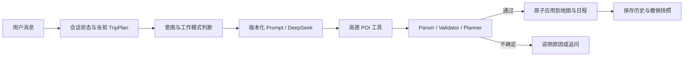

# CROSS 旅行规划 Agent 说明

## 当前目标

CROSS 将自然语言要求转换为结构化行程，并让地图、日程和对话围绕同一份 `TripPlan` 工作。当前支持单城市 1–14 天旅行，用户可以持续补充、纠正和撤销，不需要每轮重新创建草案。

## 三种工作模式

- `import`：用户提供已有路线。原始分天和顺序是事实来源；节奏只做检测，不作为删减约束。
- `generate`：用户提供城市、天数、兴趣和节奏偏好，Agent 搜索候选 POI 并编排完整路线。
- `modify`：基于当前正式 Plan 执行局部操作，未被用户点名的日期和锁定地点保持不变。

普通咨询使用 `answer_only`，不会修改行程。缺少城市或天数时使用 `ask_clarification`，每次最多追问一个必要信息。

## Harness 数据流



发送给模型的上下文限制为最近 12 条消息、当前约束和完整当前行程摘要；浏览器本地仍保存完整历史。每条路线拥有独立 `Trip ID` 和会话。

## 结构与约束

导入模式使用 `Trip → Day → Activity` 层级。活动类型包括 `poi`、`food`、`shopping`、`transport` 和 `note`，购物与返程不会被强制转换为地图 POI。

`pacePreference` 表示用户明确希望的节奏；`detectedPace` 表示系统根据导入行程检测出的实际强度。导入路线不会因为已有“轻松”标签而删除地点。

确定性执行支持新增、删除、替换、移动、重排、锁定、解锁、单日节奏调整、单日重排和整体重排。执行前后校验坐标、日期、锁定状态和顺序连续性；失败时不应用部分结果。

## Prompt 与工具协议

Prompt 位于 `server/prompts/registry.js`，当前包含：

- `v0-baseline`：扁平 POI 抽取基线，仅用于实验对比。
- `v1-structured`：保留 Day-Activity 关系、活动类型和原文证据的默认版本。

DeepSeek 返回的每个 `tool_call_id` 都必须有对应工具结果。高德请求在服务端串行限速，并对 QPS 限制进行有限重试。API Key 不进入前端。

## 交互行为

- Agent 运行时输入框仍可使用；新要求会中止旧请求。
- 只有最新 `requestId` 可以更新地图，过期结果不得覆盖新要求。
- 成功修改前保存包含路线、地点和日程的撤销快照。
- 过程区展示工具、查询词、候选数量和校验结果，不展示思维链、系统 Prompt、密钥或模型原始响应。

## 当前边界

- 没有配置 `DATABASE_URL` 时，Express 路线和预算持久化不可用，但 Agent 规划仍可使用。
- 没有真实营业时间、预约状态、实时交通矩阵、票价和天气重规划。
- 没有账户级多设备会话同步、RAG、多 Agent 或无限自主循环。
- 当前真实路线合理性仍需要用户确认；离线评测不等于线上用户准确率。

## 验证命令

```bash
cd CROSS/server
npm test
npm run eval:offline
npm run eval:live -- --version=v1-structured
```

真实评测仅在服务端密钥已配置时运行。
